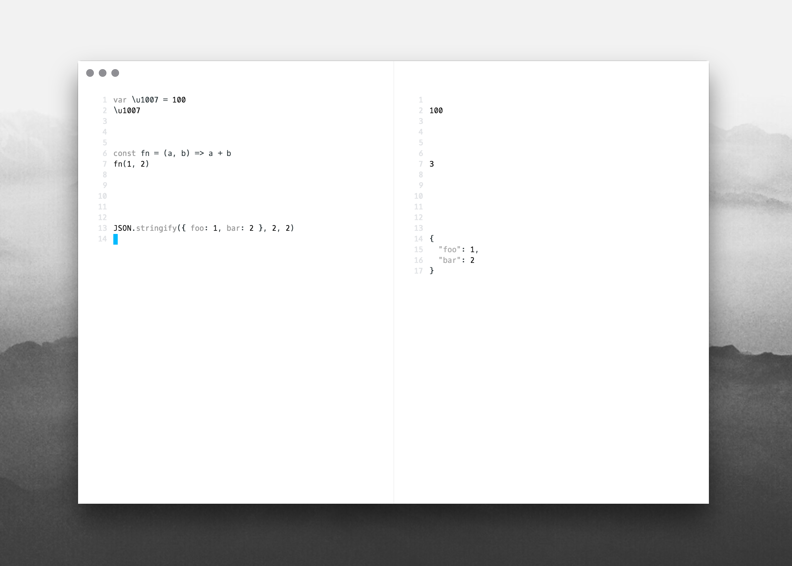

# SYNOPSIS
A javascript/node.js scratchpad.

# DESCRIPTION
If you've ever tried to code a proof-of-concept in the node repl or the chrome
dev tools, you've probably wanted to flip your table. This is just a simple
editor that evaluates text, but it's electron, so you have the node and browser
APIs.

You can also evaluate multiple scripts in tandem. The text in the editor is
split on `\n\n\n` (three new lines). The evaluated result will be positioned
(approximately) accross from the source.

# TODO
Needs an icon.
