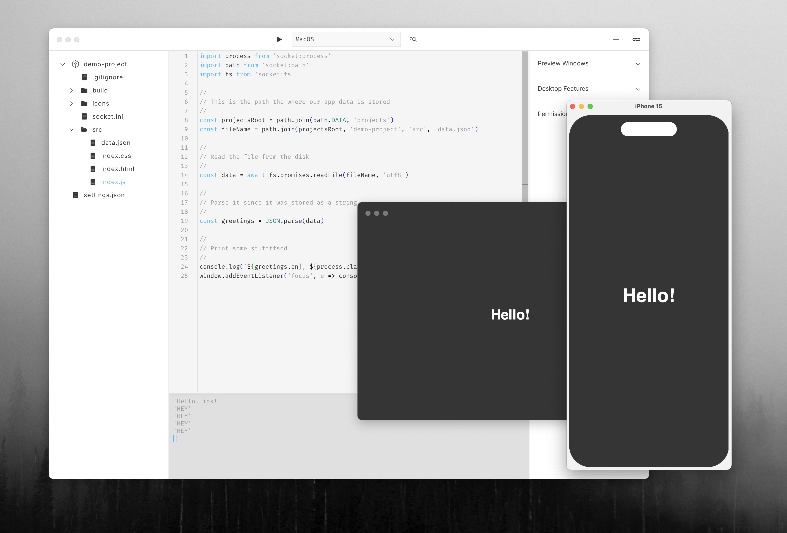
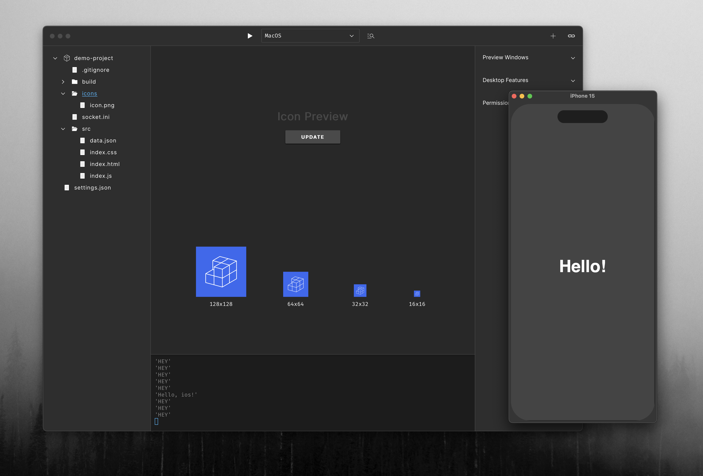

A javascript scratchpad similar to Electron Fiddle or CodePen.

- VSCode-stlye Intellisense for all Socket Runtime and Browser APIs.
- Build and run native apps for Android, iOS, and desktop.
- Evaluate the code or the selection in the editor.
- Live-reload (currently for desktop only, simulator/emulator next).

# DESCRIPTION

Socket App Studio provides a sandbox environment where developers can write, build, and run experiments or snippets of code, making it easier to test and share code. <a href="https://github.com/socketsupply/socket-app-studio">Download it from GitHub</a> for Windows, MacOS, and Linux.

