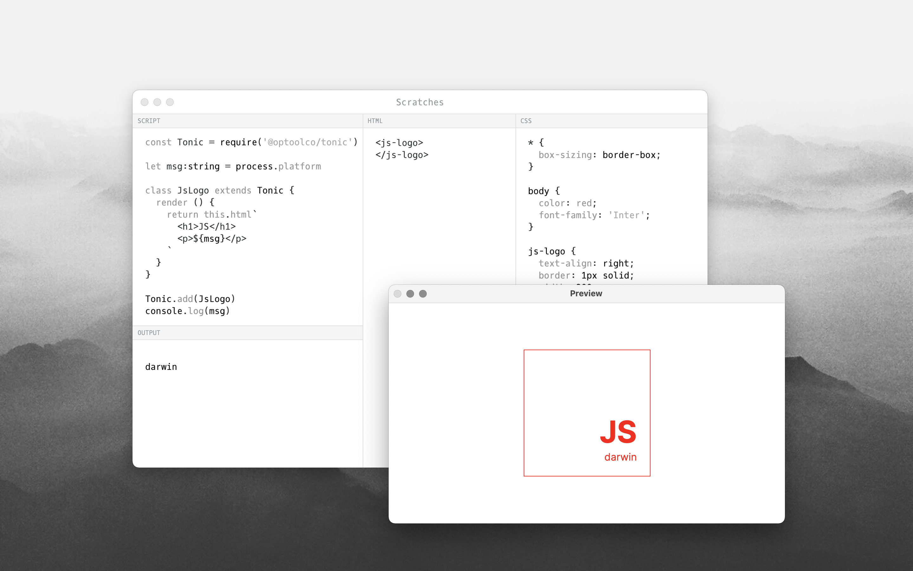

A javascript scratchpad similar to [Electron Fiddle](https://www.electronjs.org/fiddle).

Download the latest release [here](https://github.com/socketsupply/scratches/releases).

# DESCRIPTION

This is an editor that evaluates your source text and builds a sample project. It helps
you to explore and test Socket Runtime APIs.

