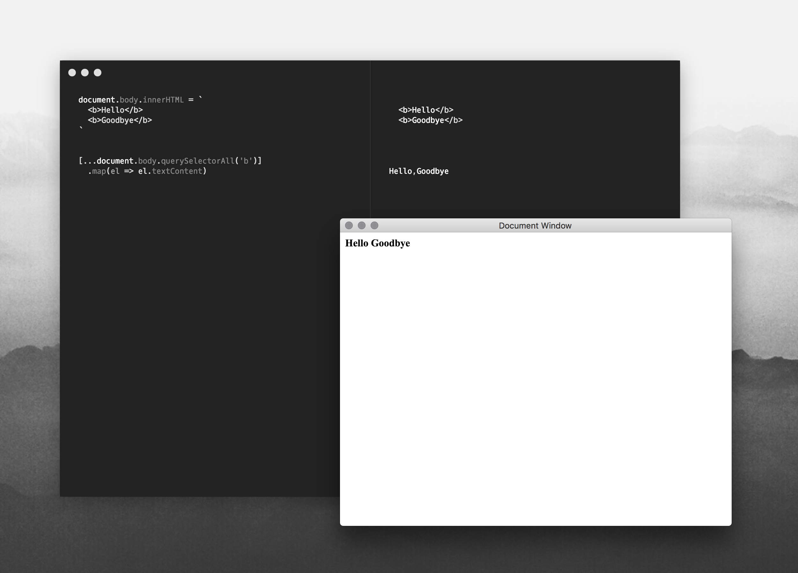

# SYNOPSIS
A javascript/node.js scratchpad.

# DESCRIPTION
If you've ever tried to code a proof-of-concept in the node repl or the chrome
dev tools, you've probably wanted to flip your table. This is just a simple
editor that evaluates text, but it's electron, so you have the node and browser
APIs.

Includes a dark mode and a document window to play with.

# TODO
Needs an icon.
